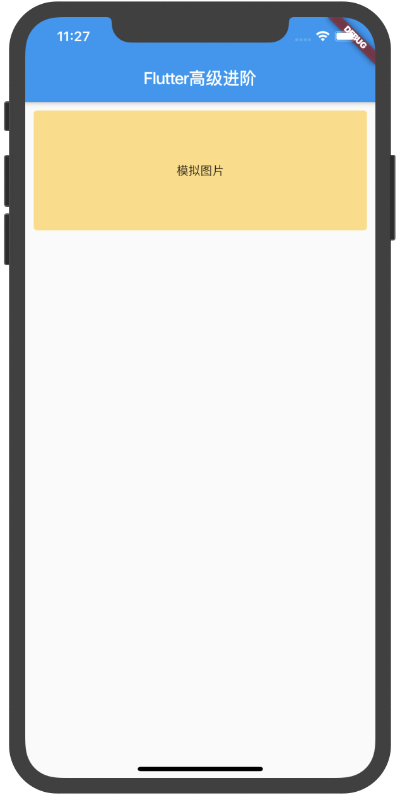
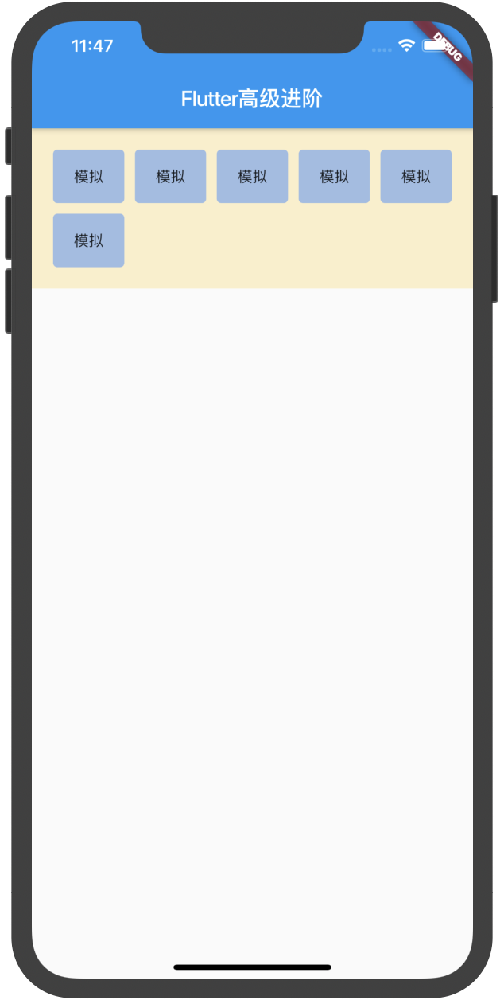
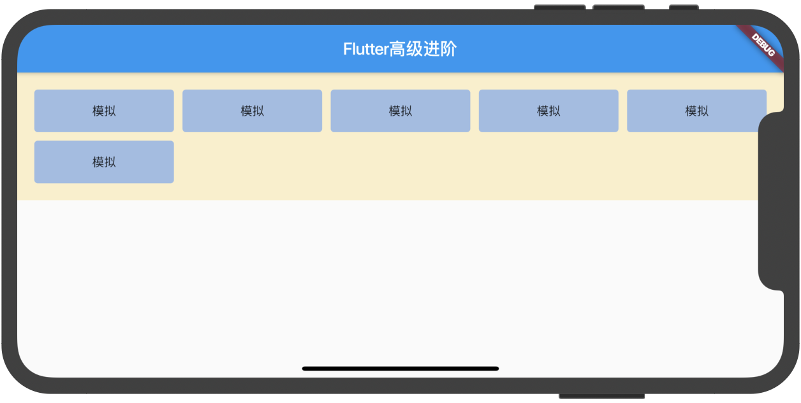

# 屏幕适配之屏幕算法

既然是算法适配就必然少不了获取屏幕宽高，我们用的就是媒体查询（MediaQuery），
下面是封装方法过后的，当然直接使用也是可以的：
```dart
// 整屏宽度
double winWidth(BuildContext context) {
  return MediaQuery.of(context).size.width;
}
// 整屏高度
double winHeight(BuildContext context) {
  return MediaQuery.of(context).size.height;
}
```

### 案例1：
蓝湖设计图有一张轮播图，宽度是 335 高度是 120，左右间隔是10，
如何使用屏幕算法适配全机型屏幕宽和高？

##### 分析：
* 左右间隔：设置margin然后左右10个间隔；
* 宽度：整宽减20，20就是左右的间隔；
* 高度：(宽度) * 120 / 335；

##### 代码：
```dart
new Container(
  height: (winWidth(context) - 20) * 120 / 335,
  width: winWidth(context) - 20,
  margin: EdgeInsets.symmetric(horizontal: 10.0),
  alignment: Alignment.center,
  decoration: BoxDecoration(
    borderRadius: BorderRadius.all(Radius.circular(4.0)),
    color: Colors.amber.withOpacity(0.5),
  ),
  child: new Text('模拟图片'),
),
```
##### 效果

|  |  |
| :-----| ----: | 

这就是一个普通的屏幕算法适配例子，他会一直按照这个比例，兼容所有机型。

### 案例2：
蓝湖设计图：未知数据数量有规则的列表视图，要求一行显示5个，
每个间隔为10（含上下），最外边距margin左右都为20，高度为50，
多出的数据继续往下排并向左对齐，适配任何机型。

##### 分析：
* 左右间隔：设置margin然后左右20个间隔；
* 间隔和高：除最外边左右，内边都为10间隔，并包含上下，高度固定50；
* 对齐方式：对齐方式默认都为向左对齐；
* 组件：推荐Wrap，动态数据，依次撑开；

##### 代码：
```dart
class MyHomePage extends StatelessWidget {
  @override
  Widget build(BuildContext context) {
    return new Scaffold(
      appBar: new AppBar(
        title: new Text('Flutter高级进阶'),
      ),
      body: new Container(
        padding: EdgeInsets.symmetric(vertical: 20.0),// 为了保持美观给了上下价格20
        color: Colors.amber.withOpacity(0.2), // 为了验证动态撑开给了背景
        child: TestRoute(),// 主代码
      ),
    );
  }
}

class TestRoute extends StatefulWidget {
  @override
  _TestRouteState createState() => _TestRouteState();
}

class _TestRouteState extends State<TestRoute> {
  Widget buildItem(item) {
    return new Container(
      decoration: BoxDecoration(
        borderRadius: BorderRadius.all(Radius.circular(4.0)), // 圆角
        color: Colors.blueAccent.withOpacity(0.5),// item颜色
      ),
      height: 50.0, // 高度
      alignment: Alignment.center, // item文本剧中
      width: (winWidth(context) - 80) / 5, // 宽度
      child: new Text('模拟'),
    );
  }

  @override
  Widget build(BuildContext context) {
    return new Container(
      width: winWidth(context) - 40, // 宽度容器算法
      margin: EdgeInsets.symmetric(horizontal: 20.0),
      child: new Wrap(
        spacing: 10.0,
        runSpacing: 10.0,
        children: [0, 1, 2, 3, 4, 5].map(buildItem).toList(),
      ),
    );
  }
}
```
##### 效果

|  |  |
| :-----| ----: | 

# 原理：

其实这就是最基本的屏幕算法，使用的是小学数学里的常用加减乘除，用了多少就用整个的减多少，
很常见也很简单很实用，在企业开发中用到这套就已经能完全适配所有屏幕了，主要是灵活应变。

不过能用组件来适配的还是建议使用组件。