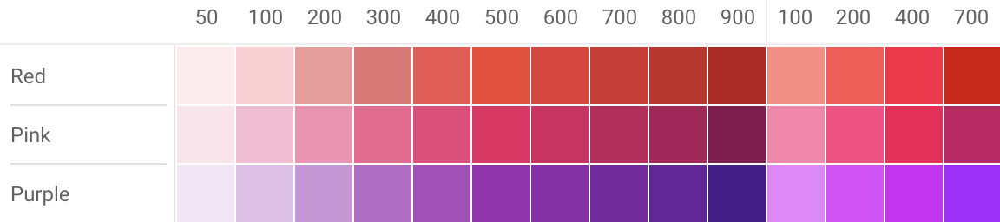

# App主题色控制

* Theme有两种：
全局Theme和局部Theme。 全局Theme是由应用程序根MaterialApp创建的Theme 。

* Theme作用：
可以设置Widget的主题，提高开发效率和速度，保持App主题统一性或某种一致性。

# Theme
Theme组件可以为Material APP定义主题数据（ThemeData）。Material组件库里很多组件都使用了主题数据，
如导航栏颜色、标题字体、Icon样式等。Theme内会使用InheritedWidget来为其子树共享样式数据。

### ThemeData（Color类型属性）：

* accentColor - 前景色（文本、按钮等）
* backgroundColor - 与`primaryColor`对比的颜色(例如 用作进度条的剩余部分)。
* bottomAppBarColor - `BottomAppBar`的默认颜色。
* buttonColor - `Material`中`RaisedButtons`使用的默认填充色。
* canvasColor - `MaterialType.canvas Material`的默认颜色。
* cardColor - `Material`被用作`Card`时的颜色。
* dialogBackgroundColor - `Dialog`元素的背景色。
* disabledColor - 用于`Widget`无效的颜色，无论任何状态。例如禁用复选框。
* dividerColor - `Dividers和PopupMenuDividers`的颜色，也用于`ListTiles`中间，和DataTables的每行中间.
* errorColor - 用于输入验证错误的颜色，例如在`TextField`中。
* highlightColor - 用于类似墨水喷溅动画或指示菜单被选中的高亮颜色。
* hintColor - 用于提示文本或占位符文本的颜色，例如在`TextField`中。
* indicatorColor - `TabBar`中选项选中的指示器颜色。
* primaryColor - App主要部分的背景色（`ToolBar`,`TabBar`等）。
* primaryColorDark - `primaryColor`的较暗版本。
* primaryColorLight - `primaryColor`的较亮版本。
* scaffoldBackgroundColor - 作为`Scaffold`基础的`Material`默认颜色，典型`Material`应用或应用内页面的背景颜色。
* secondaryHeaderColor - 有选定行时`PaginatedDataTable`标题的颜色。
* selectedRowColor - 选中行时的高亮颜色。
* splashColor - 墨水喷溅的颜色。
* textSelectionColor - 文本字段中选中文本的颜色，例如`TextField`。
* textSelectionHandleColor - 用于调整当前文本的哪个部分的句柄颜色。
* toggleableActiveColor - 用于突出显示切换`Widget`（如`Switch`，`Radio`和`Checkbox`）的活动状态的颜色。
* unselectedWidgetColor - 用于`Widget`处于非活动（但已启用）状态的颜色。 例如，未选中的复选框。 通常与`accentColor`形成对比。
* focusColor - 焦点获取时的颜色，例如，一些按钮焦点、输入框焦点。
* hoverColor - 点击之后徘徊中的颜色，例如，按钮长按，按住之后的颜色。
* cursorColor - 输入框光标颜色。


### ThemeData（Theme相关类型属性）：

* accentIconTheme - `IconThemeData`类型，与突出颜色对照的图片主题。
* accentTextTheme - `TextTheme`类型，与突出颜色对照的文本主题。
* chipTheme - `ChipThemeData`类型，用于渲染`Chip`的颜色和样式。
* buttonTheme - `ButtonThemeData`类型，定义了按钮等控件的默认配置，像`RaisedButton`和`FlatButton`。
* primaryIconTheme - `IconThemeData`类型，一个与主色对比的图片主题。
* primaryTextTheme - `TextThemeData`类型，一个与主色对比的文本主题。
* iconTheme - `IconThemeData`类型，与卡片和画布颜色形成对比的图标主题。
* inputDecorationTheme - `InputDecorationTheme`类型，`InputDecorator`，`TextField`和`TextFormField`的默认`InputDecoration`值基于此主题。
* sliderTheme - `SliderThemeData`类型，用于渲染`Slider`的颜色和形状。
* textTheme - `TextTheme`类型，与卡片和画布对比的文本颜色。
* toggleButtonsTheme - `ToggleButtonsThemeData`类型，​Flutter 1.9 全新组件 `ToggleButtons` 的主题。
* tabBarTheme - `TabBarTheme`类型，`TabBar`的主题样式。
* tooltipTheme - `TooltipThemeData`类型，`tooltip`提示的主题样式。
* cardTheme - `CardTheme`类型，卡片的主题样式。
* pageTransitionsTheme - `PageTransitionsTheme`类型，页面转场主题样式。
* appBarTheme - `AppBarTheme`类型，`AppBar`主题样式。
* bottomAppBarTheme - `BottomAppBarTheme`类型，底部导航主题样式。
* dialogTheme - `DialogTheme`类型，对话框主题样式。
* floatingActionButtonTheme - `FloatingActionButtonThemeData`类型，`FloatingActionButton`的主题样式，也就是`Scaffold`属性的那个。
* cupertinoOverrideTheme - `CupertinoThemeData`类型，`cupertino`覆盖的主题样式。
* snackBarTheme - `SnackBarThemeData`类型，弹出的`snackBar`的主题样式。
* bottomSheetTheme - `BottomSheetThemeData`类型，底部滑出对话框的主题样式。
* popupMenuTheme - `PopupMenuThemeData`类型，弹出菜单对话框的主题样式。
* bannerTheme - `MaterialBannerThemeData`类型，`Material`材质的`Banner`主题样式。
* dividerTheme - `DividerThemeData`类型，`Divider`组件的主题样式，也就是那个横向线条组件。

### ThemeData（其他类型属性）：

* accentColorBrightness - `Brightness`类型，`accentColor`的亮度。 用于确定放置在突出颜色顶部的文本和图标的颜色（例如`FloatingButton`上的图标）。
* brightness - `Brightness`类型，应用程序整体主题的亮度。 由按钮等`Widget`使用，以确定在不使用主色或强调色时要选择的颜色。
* platform - `TargetPlatform`类型，`Widget`需要适配的目标类型。
* splashFactory - `InteractiveInkFeatureFactory`类型，定义`InkWall`和`InkResponse`生成的墨水喷溅的外观。
* primaryColorBrightness - `Brightness`类型，`primaryColor`的亮度。
* fontFamily - `String`类型，字体样式。
* applyElevationOverlayColor `bool`类型，是否应用`elevation`覆盖颜色。
* materialTapTargetSize - `MaterialTapTargetSize`类型，`Chip`等组件的尺寸主题设置，如：设置为`MaterialTapTargetSize.shrinkWrap`时，`clip`距顶部距离为0；设置为`MaterialTapTargetSize.padded`时距顶部有一个距离
* colorScheme - `ColorScheme`类型，scheme组颜色，一组13种颜色，可用于配置大多数组件的颜色属性。
* typography - `Typography`类型,用于配置`TextTheme`、`primaryTextTheme`和`accentTextTheme`的颜色和几何文本主题值。

# 设置主题
##### 全局：
```dart
/// 全局主题在MaterialApp的theme属性
/// 全局生效
new MaterialApp(
  title: 'demo',
  theme: new ThemeData( // 这里就是参数
    brightness: Brightness.dark,
    primaryColor: Colors.lightBlue[800],
    accentColor: Colors.cyan[600],
  ),
);
```
##### 局部：
```dart
/// 假如我们要给FloatingActionButton设置主题样式
/// 直接写个Theme包裹FloatingActionButton组件
/// 然后设置data，接收类型依然是ThemeData，里面填写我们的参数
/// （如果没有设置局部主题则默认使用全局主题）
new Theme(
  data: new ThemeData(
    accentColor: Colors.yellow,
  ),
  child: new FloatingActionButton(
    onPressed: () {},
    child: new Icon(Icons.add),
  ),
);
```

##### 扩展父主题：
```dart
/// 扩展父主题时无需覆盖所有的主题属性，可以通过使用copyWith方法来实现
new Theme(
  data: Theme.of(context).copyWith(accentColor: Colors.yellow),
  child: new FloatingActionButton(
    onPressed: null,
    child: new Icon(Icons.add),
  ),
);
```
`Theme.of(context)`将查找Widget树并返回树中最近的Theme。如果Widget之上有一个单独的Theme定义，
则返回该值。如果不是，则返回App主题。

##### 判断平台显示指定主题：
```dart
/// defaultTargetPlatform在foundation包里。
/// 
/// 我们也可以使用io包里的Platform来进行判断。
/// 那么判断就是
/// theme: Platform.isIOS ? iOSTheme : AndroidTheme,
new MaterialApp(
  theme: defaultTargetPlatform == TargetPlatform.iOS
      ? iOSTheme
      : AndroidTheme,
  title: 'Flutter Theme',
  home: new MyHomePage(),
);
```

##### Tips:
Flutter的Color中大多数颜色从100到900，增量为100，加上颜色50，数字越小颜色越浅，
数字越大颜色越深。强调色调只有100、200、400和700。

##### 栗子：



##### 推荐站点(Material design)：
[https://material.io/resources/color](https://material.io/resources/color)
