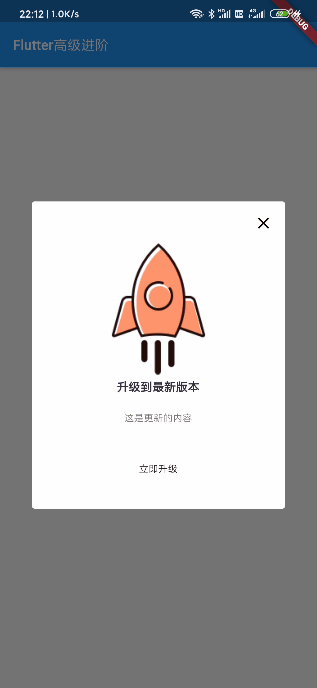

# App内更新并自动打开安装
##### 实现效果：


##### 需要的小火箭图片：


##### 需求：
* 进入App进行一次检测，如有新版本则弹出更新对话框；
* 如后台设置强制更新则无任何取消更新进入App的可能性；
* 显示更新内容和版本信息Log等；
* 如用户点击更新按钮则开始下载并展示下载进度；
* 下载安装包完毕后直接打开安装包进入安装页面；

##### 分析：
* 需要字段：是否强制更新、更新内容、安装包URL；
* 使用WillPopScope拦截返回事件；
* 因为需要显示下载进度则dialog内需要放有状态类；
* 如果不需要强制更新则显示出❌，允许用户取消更新；

##### 第三方库：

|  名称   | 作用  |
|  ----  | ----  |
| package_info  | app版本和平台信息 |
| url_launcher  | 打开AppStore更新IOS版安装包 |
| open_file  | 打开安装包进入安装页面 |
| path_provider  | 配置安装包下载路径 |
| dio  | 接口最新版本数据、下载安装包 |

# 开干
1.首先把需要的库配置一下,在我们的`pubspec.yaml`文件
```yaml
url_launcher: any
package_info: any
open_file: any
path_provider: any
dio: any
```
2.定义模拟的数据
```dart
Map mockData = {
  'isForceUpdate': false, // 是否强制更新
  'content': '这是更新的内容',
  'url': 'http://www.flutterj.com/test.apk', // 安装包的链接
};
```
3.写对话框
```dart
Future<void> updateAlert(BuildContext context, Map data) async {
  bool isForceUpdate = data['isForceUpdate']; // 从数据拿到是否强制更新字段

  new Future.delayed(Duration(seconds: 2)).then((value) {
    showDialog( // 显示对话框
      context: context,
      barrierDismissible: false, // 点击空白区域不结束对话框
      builder: (_) => new WillPopScope( // 拦截返回键
        child: new UpgradeDialog(data, isForceUpdate, updateUrl: data['url']), // 有状态类对话框
        onWillPop: () {
          return; // 检测到返回键直接返回
        },
      ),
    );
  });
}
```
然后我们的有状态对话框类：
```dart

class UpgradeDialog extends StatefulWidget {
  final Map data; // 数据
  final bool isForceUpdate; // 是否强制更新
  final String updateUrl; // 更新的url（安装包下载地址）

  UpgradeDialog(this.data, this.isForceUpdate, {this.updateUrl});

  @override
  _UpgradeDialogState createState() => _UpgradeDialogState();
}

class _UpgradeDialogState extends State<UpgradeDialog> {
  int _downloadProgress = 0; // 进度初始化为0

  CancelToken token;
  UploadingFlag uploadingFlag = UploadingFlag.idle;

  @override
  void initState() {
    super.initState();
    token = new CancelToken(); // token初始化
  }

  @override
  Widget build(BuildContext context) {
    String info = widget.data['content']; // 更新内容

    return new Center(
      // 剧中组件
      child: new Material(
        type: MaterialType.transparency,
        textStyle: new TextStyle(color: const Color(0xFF212121)),
        child: new Container(
          width: MediaQuery.of(context).size.width * 0.8, // 宽度是整宽的百分之80
          decoration: BoxDecoration(
            color: Colors.white, // 背景白色
            borderRadius: BorderRadius.all(Radius.circular(4.0)), // 圆角
          ),
          child: new Wrap(
            children: <Widget>[
              new SizedBox(height: 10.0, width: 10.0),
              new Align(
                alignment: Alignment.topRight,
                child: widget.isForceUpdate
                    ? new Container()
                    : new InkWell(
                        // 不强制更新才显示这个
                        child: new Padding(
                          padding: EdgeInsets.only(
                            top: 5.0,
                            right: 15.0,
                            bottom: 5.0,
                            left: 5.0,
                          ),
                          child: new Icon(
                            Icons.clear,
                            color: Colors.black,
                          ),
                        ),
                        onTap: () => Navigator.of(context).pop(),
                      ),
              ),
              new Center(
                child: new Image.asset('img/upgrade1.png',
                    width: 121.5, fit: BoxFit.cover),
              ),
              new Container(
                height: 30.0,
                width: double.infinity,
                alignment: Alignment.center,
                child: new Text('升级到最新版本',
                    style: new TextStyle(
                        color: const Color(0xff343243),
                        fontSize: 17.0,
                        fontWeight: FontWeight.bold)),
              ),
              new Container(
                width: double.infinity,
                alignment: Alignment.center,
                child: new Padding(
                    padding:
                        EdgeInsets.symmetric(horizontal: 40.0, vertical: 15.0),
                    child: new Text('$info',
                        style: new TextStyle(color: Color(0xff7A7A7A)))),
              ),
              getLoadingWidget(),
              new Container(
                height: 80.0,
                width: double.infinity,
                padding: EdgeInsets.symmetric(horizontal: 10.0, vertical: 18.0),
                margin: EdgeInsets.only(bottom: 10.0),
                decoration: BoxDecoration(
                  borderRadius: new BorderRadius.only(
                      bottomLeft: Radius.circular(12.0),
                      bottomRight: Radius.circular(12.0)),
                ),
                child: new MaterialButton(
                  child: new Text('立即升级'),
                  onPressed: () => upgradeHandle(),
                ),
              ),
            ],
          ),
        ),
      ),
    );
  }

  /*
  * Android更新处理
  * */
  void _androidUpdate() async {
    final apkPath = await FileUtil.getInstance().getSavePath("/Download/");
    try {
      await Dio().download(
        widget.updateUrl,
        apkPath + "test.apk",
        cancelToken: token,
        onReceiveProgress: (int count, int total) {
          if (mounted) {
            setState(() {
              _downloadProgress = ((count / total) * 100).toInt();
              if (_downloadProgress == 100) {
                if (mounted) {
                  setState(() {
                    uploadingFlag = UploadingFlag.uploaded;
                  });
                }
                debugPrint("读取的目录:$apkPath");
                try {
                  OpenFile.open(apkPath + "test.apk");
                } catch (e) {}
                Navigator.of(context).pop();
              }
            });
          }
        },
        options: Options(sendTimeout: 15 * 1000, receiveTimeout: 360 * 1000),
      );
    } catch (e) {
      if (mounted) {
        setState(() {
          uploadingFlag = UploadingFlag.uploadingFailed;
        });
      }
    }
  }

  /*
  * 进度显示的组件
  * */
  Widget getLoadingWidget() {
    if (_downloadProgress != 0 && uploadingFlag == UploadingFlag.uploading) {
      return Container(
        padding: EdgeInsets.symmetric(vertical: 5.0),
        width: double.infinity,
        height: 40,
        alignment: Alignment.center,
        child: LinearProgressIndicator(
          valueColor:
              AlwaysStoppedAnimation<Color>(Theme.of(context).primaryColor),
          backgroundColor: Colors.grey[300],
          value: _downloadProgress / 100,
        ),
      );
    }
    
    /*
    * 如果是在进行中并且进度为0则显示
    * */
    if (uploadingFlag == UploadingFlag.uploading && _downloadProgress == 0) {
      return Container(
        alignment: Alignment.center,
        height: 40,
        child: Row(
          mainAxisAlignment: MainAxisAlignment.center,
          crossAxisAlignment: CrossAxisAlignment.center,
          children: <Widget>[
            CircularProgressIndicator(
                valueColor: AlwaysStoppedAnimation<Color>(mainTextColor)),
            SizedBox(width: 5),
            Material(
              child: Text(
                '等待',
                style: TextStyle(color: mainTextColor),
              ),
              color: Colors.transparent,
            )
          ],
        ),
      );
    }
    
    /*
    * 如果下载失败则显示
    * */
    if (uploadingFlag == UploadingFlag.uploadingFailed) {
      return Container(
        alignment: Alignment.center,
        height: 40,
        child: Row(
          mainAxisAlignment: MainAxisAlignment.center,
          crossAxisAlignment: CrossAxisAlignment.center,
          children: <Widget>[
            Icon(Icons.clear, color: Colors.redAccent),
            SizedBox(width: 5),
            Material(
              child: Text(
                '下载超时',
                style: TextStyle(color: mainTextColor),
              ),
              color: Colors.transparent,
            )
          ],
        ),
      );
    }
    return Container();
  }

  /*
  * IOS更新处理，直接打开AppStore链接
  * */
  void _iosUpdate() {
    launch(widget.updateUrl);
  }

  /*
  * 更新处理事件
  * */
  upgradeHandle() {
    if (uploadingFlag == UploadingFlag.uploading) return;
    uploadingFlag = UploadingFlag.uploading;
    // 必须保证当前状态安全，才能进行状态刷新
    if (mounted) setState(() {});
    // 进行平台判断
    if (Platform.isAndroid) {
      _androidUpdate();
    } else if (Platform.isIOS) {
      _iosUpdate();
    }
  }

  ///跳转本地浏览器
  launchURL(String url) async {
    if (await canLaunch(url)) {
      await launch(url);
    } else {
      throw 'Could not launch $url';
    }
  }
  
  @override
  void dispose() {
    if (!token.isCancelled) token?.cancel();
    super.dispose();
    debugPrint("升级销毁");
  }
}
```
然后我们需要一个文件路径工具类和一个类型枚举：
```dart
enum UploadingFlag { uploading, idle, uploaded, uploadingFailed }

// 文件工具类
class FileUtil {
  static FileUtil _instance;

  static FileUtil getInstance() {
    if (_instance == null) {
      _instance = FileUtil._internal();
    }
    return _instance;
  }

  FileUtil._internal();

  /*
  * 保存路径
  * */
  Future<String> getSavePath(String endPath) async {
    Directory tempDir = await getApplicationDocumentsDirectory();
    String path = tempDir.path + endPath;
    Directory directory = Directory(path);
    if (!directory.existsSync()) {
      directory.createSync(recursive: true);
    }
    return path;
  }
}
```
然后我们就可以直接在初始化的时候调用就行了：
```dart
class MyHomePage extends StatefulWidget {
  @override
  _MyHomePageState createState() => _MyHomePageState();
}

class _MyHomePageState extends State<MyHomePage> {
  @override
  void initState() {
    super.initState();
    Map mockData = {
      'isForceUpdate': false,// 是否强制更新
      'content': '这是更新的内容',
      'url': 'http://www.flutterj.com/test.apk',// 安装包的链接
    };
    updateAlert(context, mockData);
  }
  @override
  Widget build(BuildContext context) {
    return new Scaffold(
      appBar: new AppBar(title: new Text('Flutter高级进阶')),
    );
  }
}
```

# 完整代码：
main.dart
```dart
import 'package:flutter/material.dart';
import 'package:oc_project/dialog.dart';

void main() => runApp(MyApp());

class MyApp extends StatelessWidget {
  @override
  Widget build(BuildContext context) {
    return new MaterialApp(
      title: 'Flutter高级进阶',
      home: new MyHomePage(),
    );
  }
}

class MyHomePage extends StatefulWidget {
  @override
  _MyHomePageState createState() => _MyHomePageState();
}

class _MyHomePageState extends State<MyHomePage> {
  @override
  void initState() {
    super.initState();
    Map mockData = {
      'isForceUpdate': false,// 是否强制更新
      'content': '这是更新的内容',
      'url': 'http://www.flutterj.com/test.apk',// 安装包的链接
    };
    updateAlert(context, mockData);
  }
  @override
  Widget build(BuildContext context) {
    return new Scaffold(
      appBar: new AppBar(title: new Text('Flutter高级进阶')),
    );
  }
}
```
dialog.dart
```dart
import 'dart:io';

import 'package:dio/dio.dart';
import 'package:flutter/cupertino.dart';
import 'package:flutter/material.dart';
import 'package:open_file/open_file.dart';
import 'package:url_launcher/url_launcher.dart';
import 'package:path_provider/path_provider.dart';

const mainTextColor = Color.fromRGBO(115, 115, 115, 1.0);

Future<void> updateAlert(BuildContext context, Map data) async {
  bool isForceUpdate = data['isForceUpdate']; // 从数据拿到是否强制更新字段

  new Future.delayed(Duration(seconds: 2)).then((value) {
    showDialog(
      // 显示对话框
      context: context,
      barrierDismissible: false, // 点击空白区域不结束对话框
      builder: (_) => new WillPopScope(
        // 拦截返回键
        child: new UpgradeDialog(data, isForceUpdate, updateUrl: data['url']),
        // 有状态类对话框
        onWillPop: () {
          return; // 检测到返回键直接返回
        },
      ),
    );
  });
}

class UpgradeDialog extends StatefulWidget {
  final Map data; // 数据
  final bool isForceUpdate; // 是否强制更新
  final String updateUrl; // 更新的url（安装包下载地址）

  UpgradeDialog(this.data, this.isForceUpdate, {this.updateUrl});

  @override
  _UpgradeDialogState createState() => _UpgradeDialogState();
}

class _UpgradeDialogState extends State<UpgradeDialog> {
  int _downloadProgress = 0; // 进度初始化为0

  CancelToken token;
  UploadingFlag uploadingFlag = UploadingFlag.idle;

  @override
  void initState() {
    super.initState();
    token = new CancelToken(); // token初始化
  }

  @override
  Widget build(BuildContext context) {
    String info = widget.data['content']; // 更新内容

    return new Center(
      // 剧中组件
      child: new Material(
        type: MaterialType.transparency,
        textStyle: new TextStyle(color: const Color(0xFF212121)),
        child: new Container(
          width: MediaQuery.of(context).size.width * 0.8, // 宽度是整宽的百分之80
          decoration: BoxDecoration(
            color: Colors.white, // 背景白色
            borderRadius: BorderRadius.all(Radius.circular(4.0)), // 圆角
          ),
          child: new Wrap(
            children: <Widget>[
              new SizedBox(height: 10.0, width: 10.0),
              new Align(
                alignment: Alignment.topRight,
                child: widget.isForceUpdate
                    ? new Container()
                    : new InkWell(
                        // 不强制更新才显示这个
                        child: new Padding(
                          padding: EdgeInsets.only(
                            top: 5.0,
                            right: 15.0,
                            bottom: 5.0,
                            left: 5.0,
                          ),
                          child: new Icon(
                            Icons.clear,
                            color: Colors.black,
                          ),
                        ),
                        onTap: () => Navigator.of(context).pop(),
                      ),
              ),
              new Center(
                child: new Image.asset('img/upgrade1.png',
                    width: 121.5, fit: BoxFit.cover),
              ),
              new Container(
                height: 30.0,
                width: double.infinity,
                alignment: Alignment.center,
                child: new Text('升级到最新版本',
                    style: new TextStyle(
                        color: const Color(0xff343243),
                        fontSize: 17.0,
                        fontWeight: FontWeight.bold)),
              ),
              new Container(
                width: double.infinity,
                alignment: Alignment.center,
                child: new Padding(
                    padding:
                        EdgeInsets.symmetric(horizontal: 40.0, vertical: 15.0),
                    child: new Text('$info',
                        style: new TextStyle(color: Color(0xff7A7A7A)))),
              ),
              getLoadingWidget(),
              new Container(
                height: 80.0,
                width: double.infinity,
                padding: EdgeInsets.symmetric(horizontal: 10.0, vertical: 18.0),
                margin: EdgeInsets.only(bottom: 10.0),
                decoration: BoxDecoration(
                  borderRadius: new BorderRadius.only(
                      bottomLeft: Radius.circular(12.0),
                      bottomRight: Radius.circular(12.0)),
                ),
                child: new MaterialButton(
                  child: new Text('立即升级'),
                  onPressed: () => upgradeHandle(),
                ),
              ),
            ],
          ),
        ),
      ),
    );
  }

  /*
  * Android更新处理
  * */
  void _androidUpdate() async {
    final apkPath = await FileUtil.getInstance().getSavePath("/Download/");
    try {
      await Dio().download(
        widget.updateUrl,
        apkPath + "test.apk",
        cancelToken: token,
        onReceiveProgress: (int count, int total) {
          if (mounted) {
            setState(() {
              _downloadProgress = ((count / total) * 100).toInt();
              if (_downloadProgress == 100) {
                if (mounted) {
                  setState(() {
                    uploadingFlag = UploadingFlag.uploaded;
                  });
                }
                debugPrint("读取的目录:$apkPath");
                try {
                  OpenFile.open(apkPath + "test.apk");
                } catch (e) {}
                Navigator.of(context).pop();
              }
            });
          }
        },
        options: Options(sendTimeout: 15 * 1000, receiveTimeout: 360 * 1000),
      );
    } catch (e) {
      if (mounted) {
        setState(() {
          uploadingFlag = UploadingFlag.uploadingFailed;
        });
      }
    }
  }

  /*
  * 进度显示的组件
  * */
  Widget getLoadingWidget() {
    if (_downloadProgress != 0 && uploadingFlag == UploadingFlag.uploading) {
      return Container(
        padding: EdgeInsets.symmetric(vertical: 5.0),
        width: double.infinity,
        height: 40,
        alignment: Alignment.center,
        child: LinearProgressIndicator(
          valueColor:
              AlwaysStoppedAnimation<Color>(Theme.of(context).primaryColor),
          backgroundColor: Colors.grey[300],
          value: _downloadProgress / 100,
        ),
      );
    }

    /*
    * 如果是在进行中并且进度为0则显示
    * */
    if (uploadingFlag == UploadingFlag.uploading && _downloadProgress == 0) {
      return Container(
        alignment: Alignment.center,
        height: 40,
        child: Row(
          mainAxisAlignment: MainAxisAlignment.center,
          crossAxisAlignment: CrossAxisAlignment.center,
          children: <Widget>[
            CircularProgressIndicator(
                valueColor: AlwaysStoppedAnimation<Color>(mainTextColor)),
            SizedBox(width: 5),
            Material(
              child: Text(
                '等待',
                style: TextStyle(color: mainTextColor),
              ),
              color: Colors.transparent,
            )
          ],
        ),
      );
    }

    /*
    * 如果下载失败则显示
    * */
    if (uploadingFlag == UploadingFlag.uploadingFailed) {
      return Container(
        alignment: Alignment.center,
        height: 40,
        child: Row(
          mainAxisAlignment: MainAxisAlignment.center,
          crossAxisAlignment: CrossAxisAlignment.center,
          children: <Widget>[
            Icon(Icons.clear, color: Colors.redAccent),
            SizedBox(width: 5),
            Material(
              child: Text(
                '下载超时',
                style: TextStyle(color: mainTextColor),
              ),
              color: Colors.transparent,
            )
          ],
        ),
      );
    }
    return Container();
  }

  /*
  * IOS更新处理，直接打开AppStore链接
  * */
  void _iosUpdate() {
    launch(widget.updateUrl);
  }

  /*
  * 更新处理事件
  * */
  upgradeHandle() {
    if (uploadingFlag == UploadingFlag.uploading) return;
    uploadingFlag = UploadingFlag.uploading;
    // 必须保证当前状态安全，才能进行状态刷新
    if (mounted) setState(() {});
    // 进行平台判断
    if (Platform.isAndroid) {
      _androidUpdate();
    } else if (Platform.isIOS) {
      _iosUpdate();
    }
  }

  ///跳转本地浏览器
  launchURL(String url) async {
    if (await canLaunch(url)) {
      await launch(url);
    } else {
      throw 'Could not launch $url';
    }
  }

  @override
  void dispose() {
    if (!token.isCancelled) token?.cancel();
    super.dispose();
    debugPrint("升级销毁");
  }
}

enum UploadingFlag { uploading, idle, uploaded, uploadingFailed }

// 文件工具类
class FileUtil {
  static FileUtil _instance;

  static FileUtil getInstance() {
    if (_instance == null) {
      _instance = FileUtil._internal();
    }
    return _instance;
  }

  FileUtil._internal();

  /*
  * 保存路径
  * */
  Future<String> getSavePath(String endPath) async {
    Directory tempDir = await getApplicationDocumentsDirectory();
    String path = tempDir.path + endPath;
    Directory directory = Directory(path);
    if (!directory.existsSync()) {
      directory.createSync(recursive: true);
    }
    return path;
  }
}
```
