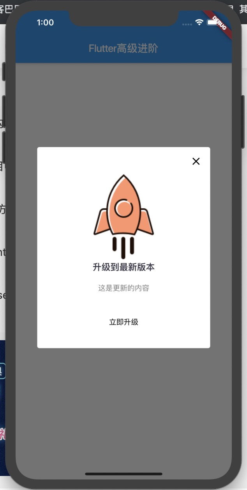

# App内更新并自动打开安装
##### 实现页面：


##### 需要的小火箭图片：


##### 需求：
* 进入App进行一次检测，如有新版本则弹出更新对话框；
* 如后台设置强制更新则无任何取消更新进入App的可能性；
* 显示更新内容和版本信息Log等；
* 如用户点击更新按钮则开始下载并展示下载进度；
* 下载安装包完毕后直接打开安装包进入安装页面；

##### 分析：
* 需要字段：是否强制更新、更新内容、安装包URL；
* 使用WillPopScope拦截返回事件；
* 因为需要显示下载进度则dialog内需要放有状态类；
* 如果不需要强制更新则显示出❌，允许用户取消更新；

##### 第三方库：

|  名称   | 作用  |
|  ----  | ----  |
| package_info  | app版本和平台信息 |
| url_launcher  | 打开AppStore更新IOS版安装包 |
| open_file  | 打开安装包进入安装页面 |
| path_provider  | 配置安装包下载路径 |
| dio  | 接口最新版本数据、下载安装包 |

# 开干
1.首先把需要的库配置一下,在我们的`pubspec.yaml`文件
```yaml
url_launcher: any
package_info: any
open_file: any
path_provider: any
dio: any
```
2.定义模拟的数据
```dart
Map mockData = {
  'isForceUpdate': false, // 是否强制更新
  'content': '这是更新的内容',
  'url': 'http://www.flutterj.com/app-release.apk', // 安装包的链接
};
```
3.写对话框

偷懒中。。。。。
