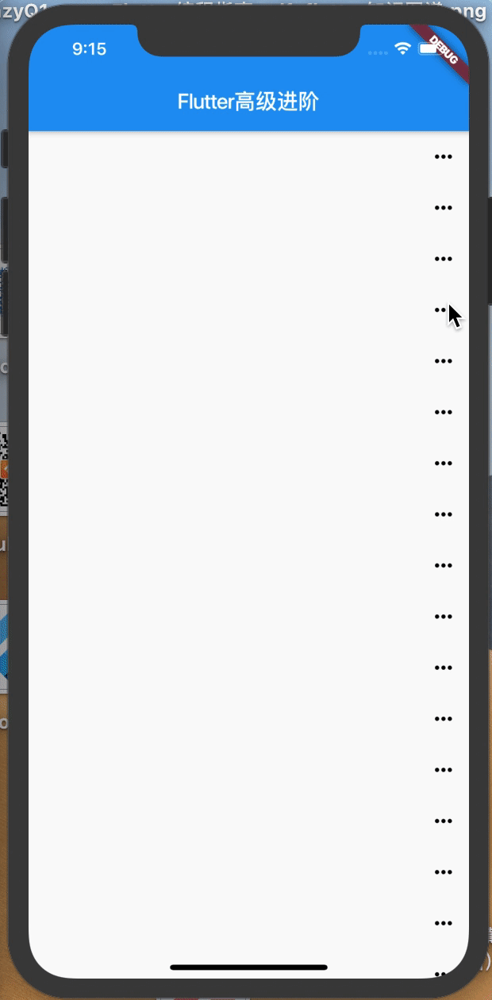

# 根据控件位置弹出对话框

##### 实现效果



首先我们要知道如何获取控件尺寸和位置信息，

* 插件必须渲染好,

```dart
final RenderBox box = globalKey.currentContext.findRenderObject();
final size = box.size;  // 获取尺寸
final topLeftPosition = box.localToGlobal(Offset.zero);
return topLeftPosition.dy;
```

* 可以通过 `context.size`获取当前控件的尺寸和位置offset信息

下面是示例，通过`context.size.height`可以拿到child控件的高度

```dart
class HeightReporter extends StatelessWidget {
  final Widget child;
 
  HeightReporter({this.child});
 
  @override
  Widget build(BuildContext context) {
  // 手势识别组件包裹一个Widget孩子
    return new GestureDetector(
      child: child,  // 获取尺寸高度并打印
      onTap: () =>  print('Height is ${context.size.height}'),
    );
  }
}
```

# 开始Demo

首先我们使用`ListView.builder`来创建很多靠右的按钮，不写`itemCount`就是无限循环的，
然后这些按钮就是我们的点击事件按钮，负责弹出对话框的；
```dart
new ListView.builder(itemBuilder: button)
```
然后按钮我们来给事件：
```dart
Widget button(context, index) {
    return new Align(
      alignment: Alignment.centerRight,
      child: new IconButton(
        icon: new Icon(Icons.more_horiz, color: Colors.black),
        onPressed: () {
          // 使用路由跳转方式
          Navigator.push(
            context,
            new PopRoute(
              child: new Popup(
                btnContext: context,
                onClick: (v) => debugPrint('你点击了$v'), // 传到外面来的回调事件
              ),
            ),
          );
        },
      ),
    );
}
```
事件给的是路由跳转，然后PopRoute是我们自定义的路由，它必须要继承PopupRoute类：
```dart
class PopRoute extends PopupRoute {
  // push的耗时，milliseconds为毫秒
  final Duration _duration = Duration(milliseconds: 300);

  // 接收一个child，也就是我们push的内容。
  Widget child;

  // 构造方法
  PopRoute({@required this.child});

  @override
  Color get barrierColor => null;

  @override
  bool get barrierDismissible => true;

  @override
  String get barrierLabel => null;

  @override
  Widget buildPage(BuildContext context, Animation<double> animation,
      Animation<double> secondaryAnimation) {
    return child;
  }

  @override
  Duration get transitionDuration => _duration;
}
```
然后push出来的内容就是Popup类，Popup类接收一个上下文context，用来获取点击的控件的位置，
OnItem就是我们的自定义类型声明回调，传了个String类型的值回去给上级接收，这个String类型的值就是赞或评论：
```dart
// 类型声明回调
typedef OnItem = Function(String value);

class Popup extends StatefulWidget {
  final BuildContext btnContext;
  final OnItem onClick; //点击child事件

  Popup({this.btnContext, this.onClick});

  PopupState createState() => PopupState();
}

class PopupState extends State<Popup> {
  // 声明对象
  RenderBox button;
  RenderBox overlay;
  RelativeRect position;

  @override
  void initState() {
    super.initState();
    // 找到并渲染对象button
    button = widget.btnContext.findRenderObject();
    // 找到并渲染对象overlay
    overlay = Overlay.of(widget.btnContext).context.findRenderObject();
    // 位置设置
    position = RelativeRect.fromRect(
      Rect.fromPoints(
        button.localToGlobal(Offset.zero, ancestor: overlay),
        button.localToGlobal(Offset.zero, ancestor: overlay),
      ),
      Offset.zero & overlay.size,
    );
  }

  // item构建
  Widget itemBuild(item) {
    // 字体样式
    TextStyle labelStyle = TextStyle(color: Colors.white);

    return new Expanded(
      child: new FlatButton(
        //点击Item
        onPressed: () {
          // 如果没接收也返回的花就会报错，所以这里需要判断
          if (widget.onClick != null) {
            Navigator.of(context).pop();
            widget.onClick(item); // 事件返回String类型的值
          }
        },
        child: new Text(item, style: labelStyle),
      ),
    );
  }

  @override
  Widget build(BuildContext context) {
    return new Material(
      type: MaterialType.transparency, // Material类型设置
      child: new GestureDetector(
        child: new Stack(
          children: <Widget>[
            new Container(
              // 设置一个容器组件，是整屏幕的。
              width: MediaQuery.of(context).size.width,
              height: MediaQuery.of(context).size.height,
              color: Colors.transparent, // 它的颜色为透明色
            ),
            new Positioned(
              child: new Container(
                width: 200,
                height: 36,
                decoration: BoxDecoration(
                  color: Color.fromRGBO(75, 75, 75, 1.0),
                  borderRadius: BorderRadius.all(Radius.circular(4.0)), // 圆角
                ),
                child: new Row(children: ['点赞', '评论'].map(itemBuild).toList()),
              ),
              top: position.top, // 顶部位置
              right: position.right, // 右边位置
            )
          ],
        ),
        onTap: () => Navigator.of(context).pop(), //点击空白处直接返回
      ),
    );
  }
}
```

# 完整代码
```dart
import 'package:flutter/material.dart';

void main() => runApp(MyApp());

class MyApp extends StatelessWidget {
  @override
  Widget build(BuildContext context) {
    return new MaterialApp(
      title: 'Flutter高级进阶',
      home: new MyHomePage(),
    );
  }
}

class MyHomePage extends StatelessWidget {
  Widget button(context, index) {
    return new Align(
      alignment: Alignment.centerRight,
      child: new IconButton(
        icon: new Icon(Icons.more_horiz, color: Colors.black),
        onPressed: () {
          // 使用路由跳转方式
          Navigator.push(
            context,
            new PopRoute(
              child: new Popup(
                btnContext: context,
                onClick: (v) => debugPrint('你点击了$v'), // 传到外面来的回调事件
              ),
            ),
          );
        },
      ),
    );
  }

  @override
  Widget build(BuildContext context) {
    return new Scaffold(
      appBar: new AppBar(title: new Text('Flutter高级进阶')),
      body: new ListView.builder(itemBuilder: button),
    );
  }
}

class PopRoute extends PopupRoute {
  // push的耗时，milliseconds为毫秒
  final Duration _duration = Duration(milliseconds: 300);

  // 接收一个child，也就是我们push的内容。
  Widget child;

  // 构造方法
  PopRoute({@required this.child});

  @override
  Color get barrierColor => null;

  @override
  bool get barrierDismissible => true;

  @override
  String get barrierLabel => null;

  @override
  Widget buildPage(BuildContext context, Animation<double> animation,
      Animation<double> secondaryAnimation) {
    return child;
  }

  @override
  Duration get transitionDuration => _duration;
}

// 类型声明回调
typedef OnItem = Function(String value);

class Popup extends StatefulWidget {
  final BuildContext btnContext;
  final OnItem onClick; //点击child事件

  Popup({this.btnContext, this.onClick});

  PopupState createState() => PopupState();
}

class PopupState extends State<Popup> {
  // 声明对象
  RenderBox button;
  RenderBox overlay;
  RelativeRect position;

  @override
  void initState() {
    super.initState();
    // 找到并渲染对象button
    button = widget.btnContext.findRenderObject();
    // 找到并渲染对象overlay
    overlay = Overlay.of(widget.btnContext).context.findRenderObject();
    // 位置设置
    position = RelativeRect.fromRect(
      Rect.fromPoints(
        button.localToGlobal(Offset.zero, ancestor: overlay),
        button.localToGlobal(Offset.zero, ancestor: overlay),
      ),
      Offset.zero & overlay.size,
    );
  }

  // item构建
  Widget itemBuild(item) {
    // 字体样式
    TextStyle labelStyle = TextStyle(color: Colors.white);

    return new Expanded(
      child: new FlatButton(
        //点击Item
        onPressed: () {
          // 如果没接收也返回的花就会报错，所以这里需要判断
          if (widget.onClick != null) {
            Navigator.of(context).pop();
            widget.onClick(item); // 事件返回String类型的值
          }
        },
        child: new Text(item, style: labelStyle),
      ),
    );
  }

  @override
  Widget build(BuildContext context) {
    return new Material(
      type: MaterialType.transparency, // Material类型设置
      child: new GestureDetector(
        child: new Stack(
          children: <Widget>[
            new Container(
              // 设置一个容器组件，是整屏幕的。
              width: MediaQuery.of(context).size.width,
              height: MediaQuery.of(context).size.height,
              color: Colors.transparent, // 它的颜色为透明色
            ),
            new Positioned(
              child: new Container(
                width: 200,
                height: 36,
                decoration: BoxDecoration(
                  color: Color.fromRGBO(75, 75, 75, 1.0),
                  borderRadius: BorderRadius.all(Radius.circular(4.0)), // 圆角
                ),
                child: new Row(children: ['点赞', '评论'].map(itemBuild).toList()),
              ),
              top: position.top, // 顶部位置
              right: position.right, // 右边位置
            )
          ],
        ),
        onTap: () => Navigator.of(context).pop(), //点击空白处直接返回
      ),
    );
  }
}
```