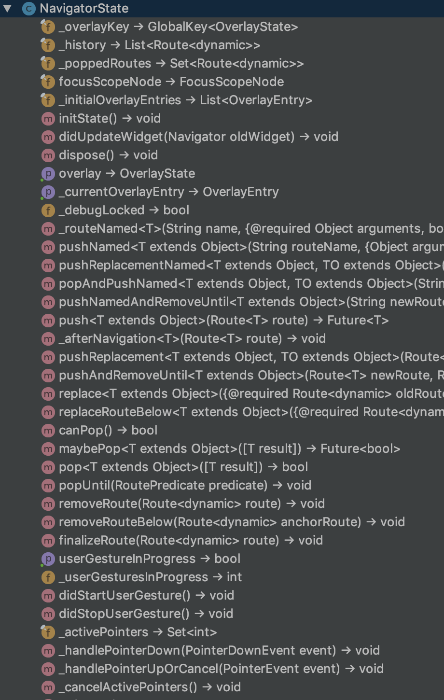
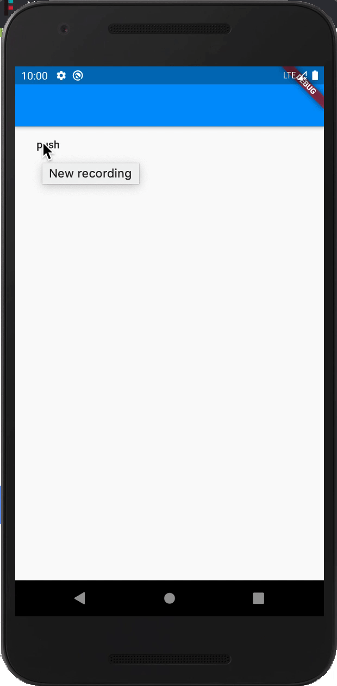

# 干掉context进行路由管理

看下我们上节课留的报错：
```dart
class MyApp extends StatelessWidget {
  @override
  Widget build(BuildContext context) {
    return new MaterialApp(
      title: 'Flutter高级进阶',
      home: new Scaffold(
        appBar: new AppBar(),
        body: new FlatButton(child: new Text("push"), onPressed: () => push(context)),
      ),
    );
  }
  /*
   * 路由跳转方法
   * */
  push(context) {
    //导航到新路由
    Navigator.push(
      context,
      MaterialPageRoute(
      // MyHomePage不写参数则默认为1
          builder: (context) => MyHomePage()),
    );
  }
}
```
报错信息：
```
I/flutter (21935): ══╡ EXCEPTION CAUGHT BY GESTURE ╞═══════════════════════════════════════════════════════════════════
I/flutter (21935): The following assertion was thrown while handling a gesture:
I/flutter (21935): Navigator operation requested with a context that does not include a Navigator.
I/flutter (21935): The context used to push or pop routes from the Navigator must be that of a widget that is a
I/flutter (21935): descendant of a Navigator widget.
I/flutter (21935): 
I/flutter (21935): When the exception was thrown, this was the stack:
I/flutter (21935): #0      Navigator.of.<anonymous closure> (package:flutter/src/widgets/navigator.dart:1475:9)
I/flutter (21935): #1      Navigator.of (package:flutter/src/widgets/navigator.dart:1482:6)
I/flutter (21935): #2      Navigator.push (package:flutter/src/widgets/navigator.dart:1107:22)
I/flutter (21935): #3      MyApp.push (package:oc_project/main.dart:18:15)
I/flutter (21935): #4      MyApp.build.<anonymous closure> (package:oc_project/main.dart:12:72)
I/flutter (21935): #5      _InkResponseState._handleTap (package:flutter/src/material/ink_well.dart:654:14)
I/flutter (21935): #6      _InkResponseState.build.<anonymous closure> (package:flutter/src/material/ink_well.dart:729:32)
I/flutter (21935): #7      GestureRecognizer.invokeCallback (package:flutter/src/gestures/recognizer.dart:182:24)
I/flutter (21935): #8      TapGestureRecognizer._checkUp (package:flutter/src/gestures/tap.dart:365:11)
I/flutter (21935): #9      TapGestureRecognizer.handlePrimaryPointer (package:flutter/src/gestures/tap.dart:275:7)
I/flutter (21935): #10     PrimaryPointerGestureRecognizer.handleEvent (package:flutter/src/gestures/recognizer.dart:455:9)
I/flutter (21935): #11     PointerRouter._dispatch (package:flutter/src/gestures/pointer_router.dart:75:13)
I/flutter (21935): #12     PointerRouter.route (package:flutter/src/gestures/pointer_router.dart:102:11)
I/flutter (21935): #13     GestureBinding.handleEvent (package:flutter/src/gestures/binding.dart:218:19)
I/flutter (21935): #14     GestureBinding.dispatchEvent (package:flutter/src/gestures/binding.dart:198:22)
I/flutter (21935): #15     GestureBinding._handlePointerEvent (package:flutter/src/gestures/binding.dart:156:7)
I/flutter (21935): #16     GestureBinding._flushPointerEventQueue (package:flutter/src/gestures/binding.dart:102:7)
I/flutter (21935): #17     GestureBinding._handlePointerDataPacket (package:flutter/src/gestures/binding.dart:86:7)
I/flutter (21935): #21     _invoke1 (dart:ui/hooks.dart:263:10)
I/flutter (21935): #22     _dispatchPointerDataPacket (dart:ui/hooks.dart:172:5)
I/flutter (21935): (elided 3 frames from package dart:async)
I/flutter (21935): 
I/flutter (21935): Handler: "onTap"
I/flutter (21935): Recognizer:
I/flutter (21935):   TapGestureRecognizer#72729
```
难道我们只能把home抽出成一个类来解决这个问题吗？实际上还有另一个方法，就是我们这节要讲的干掉那个上下文`(context)`，
来进行路由管理；

##### 分析：
上节我提到`NavigatorKey`是一个管理路由的`Key`，咋们解决方案也是用这个`NavigatorKey`；

##### 灵感来源：
我去查看`Navigator`源码的时候突然发现一个`NavigatorState`类，而且是具备`Navigator`的所有功能；



# 开始上手

首先定义一个`NavigatorKey`，也就是`GlobalKey`全局`Key`，然后范型是`NavigatorState`：
```dart
final navGK = new GlobalKey<NavigatorState>();
```
然后在`MaterialApp`设置这个`Key`为`navigatorKey`的值：
```dart
class MyApp extends StatelessWidget {
  @override
  Widget build(BuildContext context) {
    return new MaterialApp(
      title: 'Flutter高级进阶',
      navigatorKey: navGK,// 设置navigatorKey
      home: new Scaffold(
        appBar: new AppBar(),
        body: new FlatButton(child: new Text("push"), onPressed: () => push(),
        ),
      ),
    );
  }
}
```
然后使用这个`Key`来跳转即可：
```dart
push() {
  //导航到新路由
  navGK.currentState.push(
    MaterialPageRoute(
      // MyHomePage不写参数则默认为1
        builder: (context) => MyHomePage()),
  );
}
```

效果图：



这样我们就完美干掉上下文进行路由管理了；