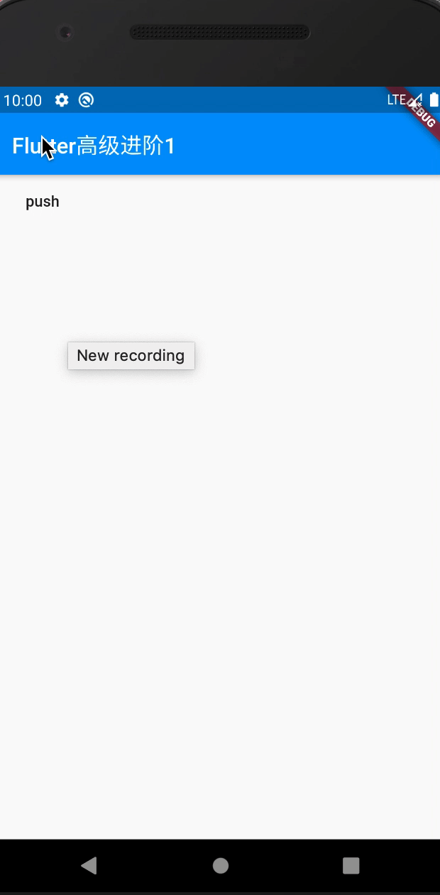
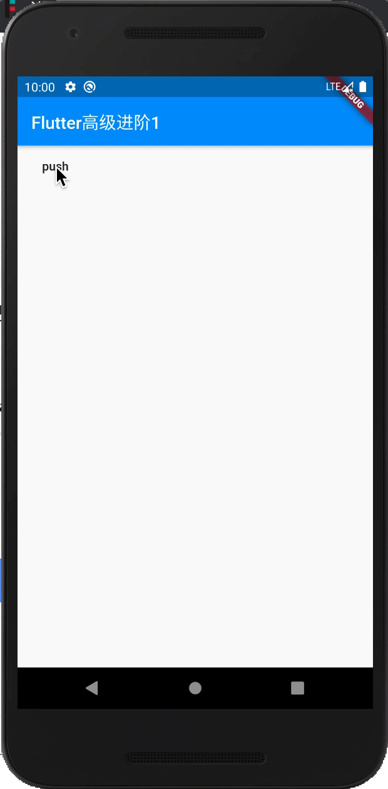
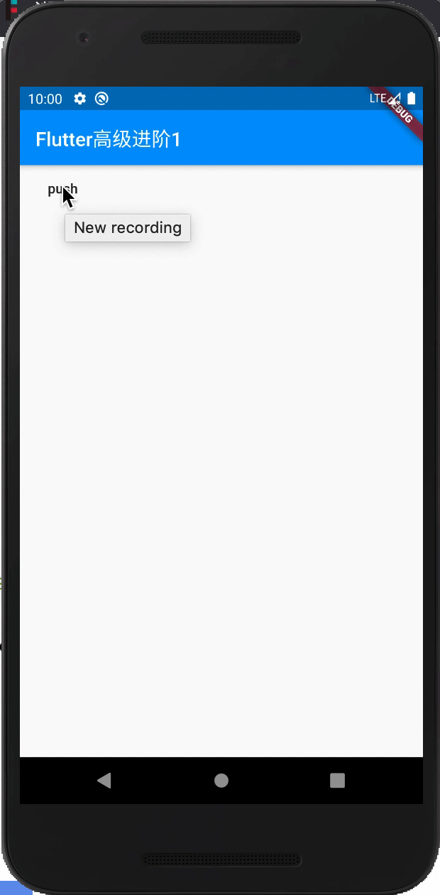

# 路由管理控制

* 路由是一个应用程序抽象的屏幕或页面；
* 路由管理就是管理页面之间如何跳转；
* 路由入栈指打开一个新页面；
* 路由出栈指一个页面关闭操作；
* 路由管理指如何来管理路由栈；
* `Navigator`是一个管理路由的`widget`；
* `NavigatorKey`是一个管理路由的`Key`；

看完本文你将学会`路由的使用`、`管理好一个路由`、`路由传参`、`路由带参返回`、
`路由记录`、`返回到指定路由`、`路由动画`，
然后使用pop操作来进行回退到某个路由；

# Navigator
|  方法   | 作用  |
|  ----  | ----  |
| pushNamed  | 按路由名字路由入栈 |
| pushReplacementNamed  | 按路由名字替换当前路由栈 |
| popAndPushNamed  | 将当前路线从导航器中弹出，并在其中推入已命名的路由位置 |
| pushNamedAndRemoveUntil  | 按路由名称将具有给定名称的路由推入导航器，然后删除所有 |
| push  | 直接路由入栈 |
| pushReplacement  | 替换当前路由栈 |
| pushAndRemoveUntil  | 将具有给定名称的路由推入导航器，然后删除所有 |
| replace  | 用新路由替换导航器上的路由 |
| replaceRouteBelow  | 用新路由替换导航器上的路由。 路由是替换为给定`anchorRoute`下面的那个 |
| canPop  | 导航器是否可以弹出。 |
| maybePop  | 导航器是否可以弹出，可以的话弹出 |
| pop  | 弹出路由 |
| popUntil  | 一直弹出直到指定路由 |
| removeRoute  | 删除指定路由 |
| removeRouteBelow  | 立即从导航器中删除一条路由，然后[Route.dispose]的要替换的路线是给定的“ anchorRoute”下方的路线。 |

# 开始上手
我们创建个普通路由跳转，跳转到原页面，但是标题的数量会+1，让我们知道当前是push到的第几个页面；

路由跳转传参示例：
```dart
import 'package:flutter/material.dart';

void main() => runApp(MyApp());

class MyApp extends StatelessWidget {
  @override
  Widget build(BuildContext context) {
    return new MaterialApp(
      title: 'Flutter高级进阶',
      home: new MyHomePage(),
    );
  }
}

class MyHomePage extends StatefulWidget {
  // 接收的num参数
  final int num;
  // MyHomePage不写参数则默认为1
  MyHomePage({this.num = 1});
  
  @override
  _MyHomePageState createState() => _MyHomePageState();
}

class _MyHomePageState extends State<MyHomePage> {
  @override
  Widget build(BuildContext context) {
    return new Scaffold(
    // 显示接收的num参数
      appBar: new AppBar(title: new Text('Flutter高级进阶${widget.num}')),
      // 按钮点击执行跳转方法
      body: new FlatButton(child: new Text("push"), onPressed: () => push()),
    );
  }
  /*
   * 路由跳转方法
   * */
  push() {
   // 拿到传过来的num然后+1 
    int num = widget.num + 1;
    //导航到新路由
    Navigator.push(
      context,
      MaterialPageRoute(
          // num传给下一级
          builder: (context) => MyHomePage(num: num)),
    );
  }
}
```
效果图：



##### 错误示例：
````dart
class MyApp extends StatelessWidget {
  @override
  Widget build(BuildContext context) {
    return new MaterialApp(
      title: 'Flutter高级进阶',
      home: new Scaffold(
        appBar: new AppBar(),
        body: new FlatButton(child: new Text("push"), onPressed: () => push(context)),
      ),
    );
  }
  /*
   * 路由跳转方法
   * */
  push(context) {
    //导航到新路由
    Navigator.push(
      context,
      MaterialPageRoute(
      // MyHomePage不写参数则默认为1
          builder: (context) => MyHomePage()),
    );
  }
}
````

报错信息：
```
I/flutter (21935): ══╡ EXCEPTION CAUGHT BY GESTURE ╞═══════════════════════════════════════════════════════════════════
I/flutter (21935): The following assertion was thrown while handling a gesture:
I/flutter (21935): Navigator operation requested with a context that does not include a Navigator.
I/flutter (21935): The context used to push or pop routes from the Navigator must be that of a widget that is a
I/flutter (21935): descendant of a Navigator widget.
I/flutter (21935): 
I/flutter (21935): When the exception was thrown, this was the stack:
I/flutter (21935): #0      Navigator.of.<anonymous closure> (package:flutter/src/widgets/navigator.dart:1475:9)
I/flutter (21935): #1      Navigator.of (package:flutter/src/widgets/navigator.dart:1482:6)
I/flutter (21935): #2      Navigator.push (package:flutter/src/widgets/navigator.dart:1107:22)
I/flutter (21935): #3      MyApp.push (package:oc_project/main.dart:18:15)
I/flutter (21935): #4      MyApp.build.<anonymous closure> (package:oc_project/main.dart:12:72)
I/flutter (21935): #5      _InkResponseState._handleTap (package:flutter/src/material/ink_well.dart:654:14)
I/flutter (21935): #6      _InkResponseState.build.<anonymous closure> (package:flutter/src/material/ink_well.dart:729:32)
I/flutter (21935): #7      GestureRecognizer.invokeCallback (package:flutter/src/gestures/recognizer.dart:182:24)
I/flutter (21935): #8      TapGestureRecognizer._checkUp (package:flutter/src/gestures/tap.dart:365:11)
I/flutter (21935): #9      TapGestureRecognizer.handlePrimaryPointer (package:flutter/src/gestures/tap.dart:275:7)
I/flutter (21935): #10     PrimaryPointerGestureRecognizer.handleEvent (package:flutter/src/gestures/recognizer.dart:455:9)
I/flutter (21935): #11     PointerRouter._dispatch (package:flutter/src/gestures/pointer_router.dart:75:13)
I/flutter (21935): #12     PointerRouter.route (package:flutter/src/gestures/pointer_router.dart:102:11)
I/flutter (21935): #13     GestureBinding.handleEvent (package:flutter/src/gestures/binding.dart:218:19)
I/flutter (21935): #14     GestureBinding.dispatchEvent (package:flutter/src/gestures/binding.dart:198:22)
I/flutter (21935): #15     GestureBinding._handlePointerEvent (package:flutter/src/gestures/binding.dart:156:7)
I/flutter (21935): #16     GestureBinding._flushPointerEventQueue (package:flutter/src/gestures/binding.dart:102:7)
I/flutter (21935): #17     GestureBinding._handlePointerDataPacket (package:flutter/src/gestures/binding.dart:86:7)
I/flutter (21935): #21     _invoke1 (dart:ui/hooks.dart:263:10)
I/flutter (21935): #22     _dispatchPointerDataPacket (dart:ui/hooks.dart:172:5)
I/flutter (21935): (elided 3 frames from package dart:async)
I/flutter (21935): 
I/flutter (21935): Handler: "onTap"
I/flutter (21935): Recognizer:
I/flutter (21935):   TapGestureRecognizer#72729
```
这个报错是因为用的这个上下文是`MaterialApp`的，这个上下文不包含`Navigator`导航器操作，
所以我们应该把`home`的那部分抽出来放另一个类；

# 路由传值并返回值
> 路由传参在上面那个例子已经有了，num就是我们的参数，然后显示在标题上就是使用了。

这节教大家路由传值并返回值，创建个`NewPage`，接收个文本值`text`，然后显示在新页面，新页面给个返回按钮，
点击返回按钮返回并带回一串值回去。

NewPage：
```dart
class NewPage extends StatelessWidget {
  final String text;

  NewPage({
    @required this.text, // 接收一个text参数
  });

  @override
  Widget build(BuildContext context) {
    return new Scaffold(
      appBar: new AppBar(title: new Text("新页面：$text")),
      body: new RaisedButton(
        onPressed: () => Navigator.pop(context, "我是返回值"),
        child: new Text("返回"),
      ),
    );
  }
}
```
然后之前写好的push方法改下，用then接收：
```dart
/*
 * 路由跳转方法
 * */
push() {
  //导航到新路由
  Navigator.push(
    context,
    MaterialPageRoute(
      // 拿到传过来的num然后++传给下一级
      builder: (context) => NewPage(text: '参数'),
    ),
  ).then((value) {
      if (value != null) print('接收到的参数：$value');
  });
}
```
这样我们就能push到新页面然后点击返回按钮就能把参数返回到push到它的那个方法，然后在then打印出来了：
```
I/flutter (21935): 接收到的参数：我是返回值
```
直接点击左上角那个返回值会为空，这样打印出来的就是：
```
I/flutter (21935): 接收到的参数：null
```
所以我们做了一个判断，不为空才执行打印，如果为空就不做任何操作；

# 路由命名
我们想执行跟name有关的Navigator方法就必须先给路由命名，比如`pushNamed`方法,
注册路由在`MaterialApp`的`routes`属性，它的定义为：
```dart
final Map<String, WidgetBuilder> routes;
```
##### 注册示例
```dart
class MyApp extends StatelessWidget {
  @override
  Widget build(BuildContext context) {
    return new MaterialApp(
      title: 'Flutter高级进阶',
      routes: {
        "newPage": (context) => new NewPage(text: '注册路由名的新页面'),
      },
      home: new MyHomePage(),
    );
  }
}
```
这样我们的newPage就注册好了，然后试试`pushNamed`方法：
```dart
/*
 * 路由跳转方法
 * */
push() {
  Navigator.pushNamed(context, "newPage").then((value) {
    if (value != null) print('接收到的参数：$value');
  });
}
```
效果图：



# 返回到指定路由
这节我们使用`popUntil`方法返回到我们想要返回到的某个路由，首先再注册两个路由名：
```dart
@override
Widget build(BuildContext context) {
  return new MaterialApp(
    title: 'Flutter高级进阶',
    routes: {
      // 新页面路由名
      "newPage": (context) => new NewPage(text: '注册路由名的新页面'),
      // 第二个路由名
      "towPage": (context) => new TowPage(),
      // 首页路由名
      "/": (context) => new MyHomePage(),
    },
//    home: new MyHomePage(), 这个必须注释，因为我们注册了根路由名："/"，否则报错
  );
}
```
TowPage:
```dart
class TowPage extends StatelessWidget {
  @override
  Widget build(BuildContext context) {
    return Scaffold(
      appBar: new AppBar(title: new Text('页面二')),
      body: new RaisedButton(
        onPressed: () => Navigator.popUntil(context, ModalRoute.withName('/')),
        child: new Text("返回到首页"),
      ),
    );
  }
}
```
然后NewPage把返回改成`push`到第二个页面：
```dart
class NewPage extends StatelessWidget {
  final String text;

  NewPage({
    @required this.text, // 接收一个text参数
  });

  @override
  Widget build(BuildContext context) {
    return new Scaffold(
      appBar: new AppBar(title: new Text("新页面：$text")),
      body: new RaisedButton(
        onPressed: () => Navigator.pushNamed(context, "towPage"),
        child: new Text("到第二个页面"),
      ),
    );
  }
}
```

效果图：



这样就实现了到第二个页面的时候点击回到首页按钮就直接返回到首页了。

# 路由记录
我们每次跳转一个新路由然后想返回到之前跳转过的某个路由难道每个都要注册路由名吗？那样的话太麻烦了，
这节就教大家`路由记录`，只要我们跳转过某个路由就记录起来，
然后最后面的路由想返回到前面的三个中的某个都不需要配置名字了。

##### 配置：
```dart
/*
 * 路由跳转方法
 * */
push() {
  Navigator.push(
    context,
    MaterialPageRoute(
      builder: (context) => MyHomePage(),
      settings: new RouteSettings(
        name: MyHomePage().toStringShort(), // 设置的路由名
        isInitialRoute: false, // 是否初始路由
      ),
    ),
  );
}
```
这样我们就把我们要跳转到的`MyHomePage`跳转了，同时还记录了路由名字；

##### 使用：
```dart
class TowPage extends StatelessWidget {
  @override
  Widget build(BuildContext context) {
    return Scaffold(
      appBar: new AppBar(title: new Text('页面二')),
      body: new RaisedButton(
        onPressed: () => Navigator.popUntil(
          context,
          // 使用记录好的路由名字
          ModalRoute.withName(MyHomePage().toStringShort()),
        ),
        child: new Text("返回到MyHomePage"),
      ),
    );
  }
}
```
这样我们就可以完美的返回到`MyHomePage`页面了，使用起来非常方便。

# 路由动画理论
路由动画就是我们跳转到下一个路由栈的时候所产生的过度动画，官方提供了两个动画：
`MaterialPageRoute`、`CupertinoPageRoute`；

##### 解释：
* MaterialPageRoute：存在于：`import 'package:flutter/material.dart';`包；
* CupertinoPageRoute：存在于：`import 'package:flutter/cupertino.dart';`包；

##### 使用：
直接把我们用来push的`MaterialPageRoute`更改为：`CupertinoPageRoute`即可查看动画效果；

# 自定义路由动画
首先编写好一个路由动画，路由动画必须继承至`PageRouteBuilder`：
```dart
/*
* 渐变动画
* */
class FadeRoute extends PageRouteBuilder {
  // 传过来的页面page
  final Widget page;
  // 构造
  FadeRoute({this.page})
      : super(
    pageBuilder: (
        BuildContext context,
        Animation<double> animation,
        Animation<double> secondaryAnimation,
        ) =>
    page,
    transitionsBuilder: (
        BuildContext context,
        Animation<double> animation,
        Animation<double> secondaryAnimation,
        Widget child,
        ) =>
        FadeTransition(
          opacity: animation, // 透明度
          child: child, // 页面存放
        ),
  );
}
```
然后push方法直接更改为：
```dart
push() {
  Navigator.push(
    context,
    FadeRoute(page: MyHomePage()),
  );
}
```

更多路由动画直接看：
* [https://github.com/fluttercandies/nav_router/tree/master/lib/routers](https://github.com/fluttercandies/nav_router/tree/master/lib/routers)